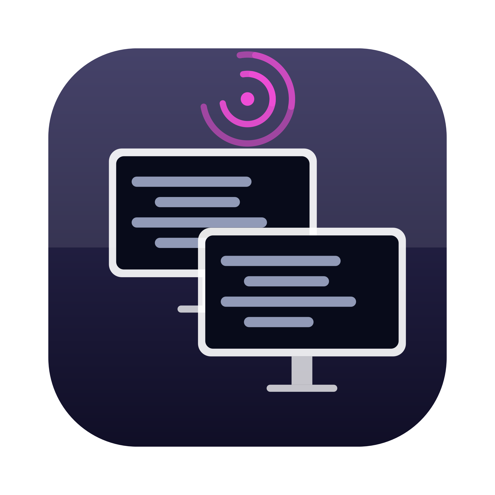
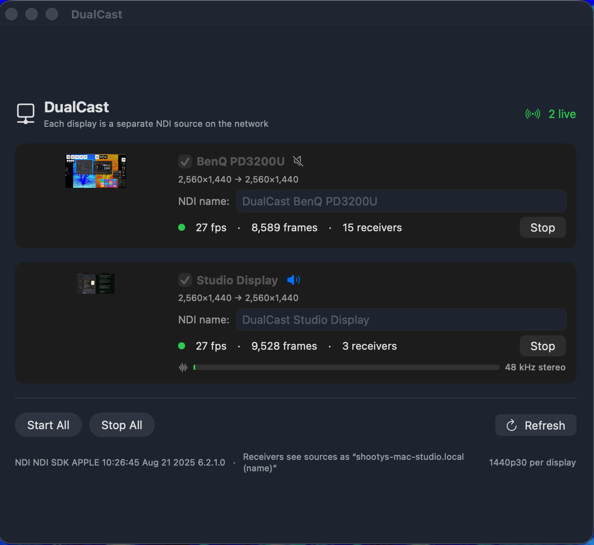
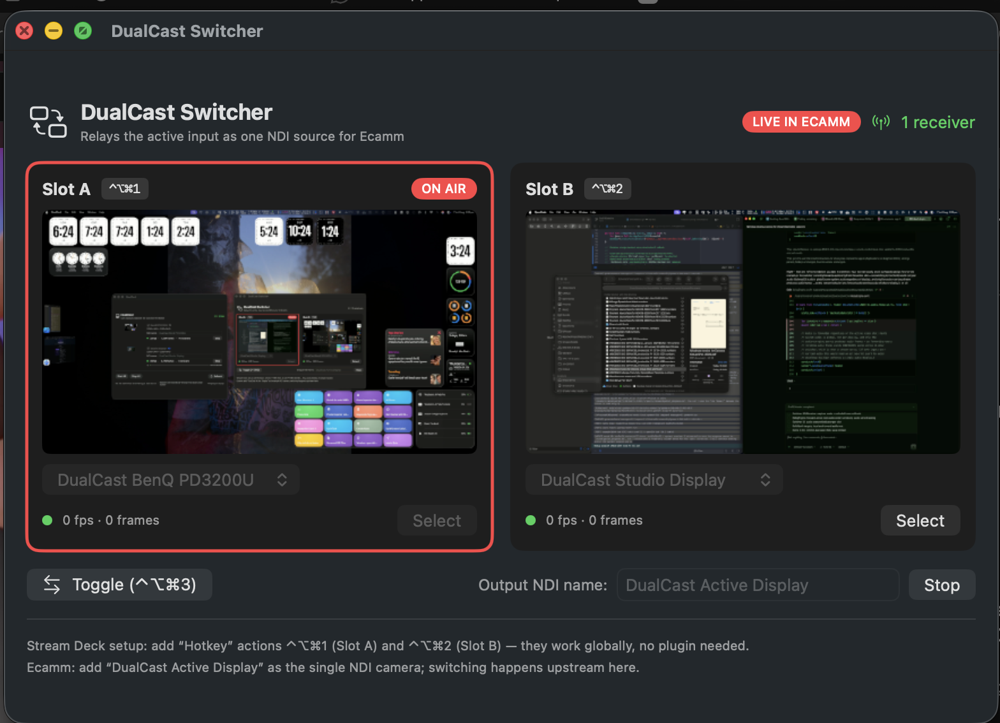

<p align="center">
  
</p>

# DualCast

Dual-display NDI screen capture for macOS — send two displays as separate NDI
sources over your network. Works with any NDI-capable receiver (Ecamm Live,
OBS, NDI Studio Monitor, etc.) with no extra software required.

[**Download DualCast 0.4.0**](https://github.com/WOODSEE-DIGI/DualCast/releases/download/v0.4.0/DualCast-0.4.0.dmg) · [License](LICENSE) · [Source on GitHub](https://github.com/WOODSEE-DIGI/DualCast)

<p align="center">
  
</p>

```
┌──────────────┐   2× NDI 1440p30   ┌───────────────────┐
│   DualCast   │ ─────────────────► │  Ecamm Live /     │
│ (coding Mac) │  Studio Display +  │  OBS / NDI Studio │
│              │       BenQ         │  Monitor / etc.   │
└──────────────┘                    └───────────────────┘
```

## Features

- Each display is a separate NDI source — zero-config discovery via mDNS
- System audio (48 kHz stereo FLTP) bundled with one stream
- Content-adaptive frame delivery: static screens use near-zero bandwidth
- Live previews, per-source fps/receiver stats, and LIVE/PREVIEW tally badges
- Auto-start on login with automatic retry and reconnect
- libndi is bundled — no NDI runtime install required

## Optional: DualCast Switcher

The repo also includes **DualCast Switcher** — a lightweight companion app
for streaming Macs that receives both NDI sources and re-broadcasts the
selected one as a single output. This is **not required** if your receiver
(Ecamm Live, OBS, etc.) can subscribe to multiple NDI sources directly.

The Switcher adds Stream Deck hotkey switching (⌃⌥⌘1 / ⌃⌥⌘2 / ⌃⌥⌘3)
and is useful when your streaming software can only see one NDI source at a
time.

<p align="center">
  
</p>

```
┌──────────────┐   2× NDI 1440p30   ┌───────────────────┐   1× NDI   ┌───────────┐
│   DualCast   │ ─────────────────► │ DualCast Switcher │ ─────────► │  Ecamm /  │
│ (coding Mac) │  Studio Display +  │  (streaming Mac)  │  selected  │ OBS / any │
│              │       BenQ         │   ⌃⌥⌘1 / ⌃⌥⌘2     │   source   │ NDI input │
└──────────────┘                    └───────────────────┘            └───────────┘
```

## Requirements

- macOS 14.0 or later, Apple Silicon or Intel
- Both Macs on the same (preferably gigabit, wired) network
- Screen Recording permission on the Mac running DualCast
- Any NDI-capable receiver: Ecamm Live, OBS + obs-ndi/DistroAV,
  NDI Studio Monitor, …

## Setup

1. **Coding Mac:** launch DualCast, grant screen recording when prompted,
   press **Start All**. Each display appears on the network as
   `YOURMAC (DualCast <Display Name>)`.
2. **Streaming software:** add each DualCast source directly as an NDI input.
   No extra software needed — Ecamm Live, OBS, and NDI Studio Monitor all
   support multiple NDI sources natively.

### With DualCast Switcher (optional)

If you need Stream Deck switching between the two displays:

1. **Streaming Mac:** launch DualCast Switcher, assign Slot A/B to the two
   sources, press **Start** (auto-starts on later launches).
2. **Streaming software:** add `STREAMINGMAC (DualCast Active Display)` as
   your camera/NDI source — once. Switching happens upstream in the Switcher.
3. **Stream Deck:** add the built-in **System → Hotkey** action
   with ⌃⌥⌘1 and ⌃⌥⌘2 on two keys. No plugin needed.

## Building from source

```sh
brew install xcodegen
xcodegen generate
xcodebuild -scheme DualCast -configuration Release build
```

To also build the Switcher:

```sh
xcodebuild -scheme DualCastSwitcher -configuration Release build
```

## License

PolyForm Noncommercial 1.0.0 — free for personal/noncommercial use.
See [LICENSE](LICENSE).

NDI® is a registered trademark of the Vizrt Group. This product bundles the
NDI runtime (see `Vendor/NDI/libndi_licenses.txt`) and is not affiliated with
or endorsed by Vizrt.
